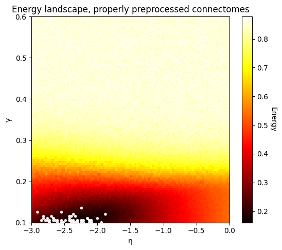

# Connectome Analysis Pipeline

---
  
### ⚠️ A Note on the Current State:

> This is a preliminary state of the repo - please do not continue to read any further.

> Kayson: I'll make some improvements, and generate some better results. You'll hopefully receive a more complete update report on Tuesday evening!

---
  
### ⚠️ TODOs (not suuuper urgent, but would be good to do): 
- [ ] rename the generated networks such that they do not have a "." in the floats for eta and gamma.... 
- [ ] If there are multiple networks that are generated with the same parameter combination: Append them all in one generated network file...  

----

### **In more detail (all preliminary):**

Hi Kayson!

If you read this: Sorry for not reaching out to you earlier! I'll send you an update on Tuesday, where I'll answer the points you raised in your last email, and where I'll update you on where I currently am project-wise.

This repo is a part of it, but there's obviously still lots to do, and I am unsure if my results are promissing at all so far.

I think that what I have been working on can be summarized as follows:
* Aiming for a repo that will be modular and expandable. 

**Currently, the repo contains scripts for:**
* preprocessing,
* the evaluation of memory capacity (MC) through **ESNs** on empirical connectomes,
* **GNM** generation and evaluation (energy) - this creates nice plots (see plot below),
* "dynamic GNMs" (in short **DynGNMs**) generation and evaluation (MC). The generation is similar to the GNM, but every next edge's placement is done in accordance to it's best location in terms of MC improvement / transfer entropy improvement / etc.

*Plot showing energy landscape of GNM sweep. This works now better than the results shown in the first update.*

---
### The big goal (for now)

> :bulb: **The research topic:** **Memory Capacity (Or Alternatively Something Else Like *Transfer Entropy*?) as a Potential Driver of Brain Network Topology: A Reservoir Computing Approach to Understanding Long-Range Connections**

<!-- ---
### Notes regarding issues: 
- If one changes scripts (that run with joblib), and they are not updated because of old versions of compiled bytecode (in ``__pycache__`` directories): Delete them all with one command: ``

        find . -type d -name "__pycache__" -exec rm -r {} +
        
        `` 

 bash scripts/run_gnm_example.sh      
 
 --> 

if "fit" does not work anymore (prob after reloading the esn module): The issue might be due to different float types (all W matrices are float32...). I used this fix in the _regressor.py script (see path below), to ensure that everything has the right shape. But those changes are limited to a specific conda environment, if I understand it correctly. 
Path: 
"/opt/miniconda3/envs/ma_thesis/lib/python3.13/site-packages/echoes/esn/_regressor.py" (approx. line 190)
        # HACK: Convert X and y to match weight matrices dtype
        target_dtype = np.float32  # or whatever your weight matrices are using
        # X = X.astype(target_dtype)
        # y = y.astype(target_dtype)
        # HACK: Convert X and y to match weight matrices dtype
        X = np.array(X, np.float32) # np.float32(X) # X.astype(target_dtype)
        y = np.array(y, np.float32) # float32(X) # y.astype(target_dtype)
        self._dtype_ = target_dtype

if GNM does not work anymore after setting up a new conda environment: Add its path to the PATH variable: 
should be somewhere here: /opt/miniconda3/envs/ma_thesis/lib/python3.13/site-packages/4D_lab_paths.pth
        /Users/adrian/Documents/01_projects/14_4D_lab/14_4D_lab_code/src
        /Users/adrian/Documents/01_projects/14_4D_lab/GenerativeNetworkModels/src/gnm

        (and maybe add even more of them) 

If there's a weird error like this: 
"OMP: Error #15: Initializing libomp.dylib, but found libomp.dylib already initialized.
OMP: Hint This means that multiple copies of the OpenMP runtime have been linked into the program. That is dangerous, since it can degrade performance or cause incorrect results. The best thing to do is to ensure that only a single OpenMP runtime is linked into the process, e.g. by avoiding static linking of the OpenMP runtime in any library. As an unsafe, unsupported, undocumented workaround you can set the environment variable KMP_DUPLICATE_LIB_OK=TRUE to allow the program to continue to execute, but that may cause crashes or silently produce incorrect results. For more information, please see http://openmp.llvm.org/
scripts/run_gnm_automated_outp_path_creation_2_3_with_indiv_conns_copy.sh: line 46: 46035 Abort trap: 6           python run_experiment.py "$CONFIG_FILE""
   conda env config vars set KMP_DUPLICATE_LIB_OK=TRUE -n ma_thesis
   conda activate ma_thesis

# Tools: 

[] Creating a nice tree: To create a nice tree, use the following command - it will create a tree only containing the directories, and excluding specific folders that contain many files: (ma_thesis) adrian@MagicBook 14_4D_lab_code % tree -d -I 'X_*|output_*|*__pycache__*' . 

# Check for orphaned processes
ps aux | grep python
# Kill any lingering multiprocessing workers if needed

# After installing a new font: 
        import matplotlib.font_manager as fm
        fm._load_fontmanager(try_read_cache=False)