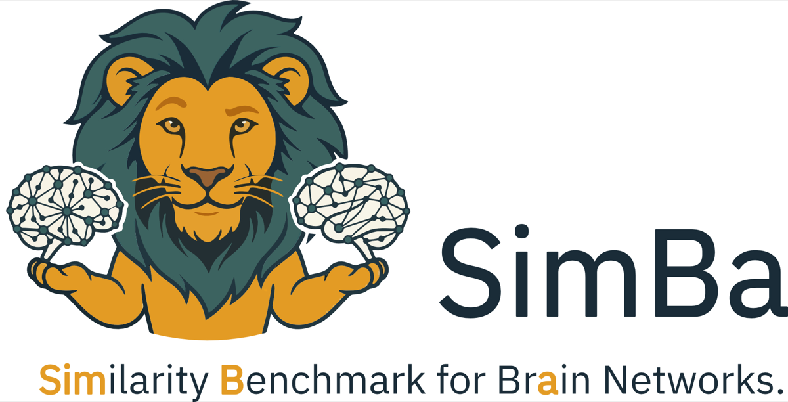

<p align="center">
  
</p>

# SimBa - Similarity Benchmark for Brain Networks

Code and data for *How Similar Are Two Brains? A Comprehensive Benchmark of
Brain Network Similarity Measures* by Adrian Dendorfer, Andrea Luppi, Francesco
Poli, Alexa Mousley, Duncan Astle and Kayson Fakhar.

The paper benchmarks 16 network distance measures for comparing generative
network model (GNM) output with an empirical human connectome, on five criteria:
agreement, biological plausibility, computational efficiency, sensitivity and
robustness, and accuracy. This repository releases all 25,000 generated networks 
<!-- , every benchmark table --> 
and the full pipeline
<!-- ,  -->
as a package that scores a new
measure against the same five criteria.

**Documentation: https://ad045.github.io/simba/**

## Coming from the paper

| You want to | Go to |
|---|---|
<!-- | Find the code behind a Methods section, figure or number | [Reproducing the paper](docs/paper.md#from-the-paper-to-the-code) |
| Look up a measure (paper name to code) | [`simba_networks/measures.py`](simba_networks/measures.py), table in [Reproducing the paper](docs/paper.md#measure-names) |
| Recompute every per-measure read-out without the pipeline | `simba_networks.published_readouts()` | -->
| Score a new measure on the five criteria | below |
<!-- | Re-run the whole pipeline | [Reproducing the paper](docs/paper.md) | -->

## Score your own measure

```bash
pip install git+https://github.com/ad045/simba
```

```python
import numpy as np
import simba_networks as sb

def degree_l1(A, B):
    """Lower = more alike. A: generated network, B: reference (100 x 100, binary)."""
    return float(np.abs(A.sum(0) - B.sum(0)).sum())

# evaluate accuracy (parameter recovery) only: needs no empirical data
report = sb.evaluate(degree_l1, criteria=["accuracy"])

# evaluate all five criteria: needs the empirical reference connectome (a binary,
# symmetric (100, 100) array without self-loops). Pass either the path, or the array
# itself. Or drop the file in `~/simba_networks_data/reference/consensus.npy` and
# then call `sb.evaluate(degree_l1)` without a reference. 
report = sb.evaluate(degree_l1, reference="path/to/consensus.npy")

print(report.table)     # every read-out of the paper, next to the eight selected measures
```

Four of the five criteria compare generated networks against the empirical HCP
consensus connectome, which we cannot redistribute. Put your copy at
`~/simba_networks_data/reference/consensus.npy`, or pass it as
`sb.evaluate(..., reference=my_array)`
([details](https://ad045.github.io/simba/reference/)). Without it, pass
`criteria=["accuracy"]`: parameter recovery is generated-against-generated and
needs no empirical data.

The benchmark data (about 30 MB) ship in `data/`; a pip install downloads the
same bundle once into `~/simba_networks_data`.

## Repository layout

```
simba_networks/   the package: the 16 measures, data access, evaluate()
data/             the released data: 25,000 generated networks, the recovery
                  networks, every benchmark table (layout in data/README.md)
tests/            checks that the package reproduces the published numbers
docs/             documentation site (mkdocs)
paper/            the research pipeline behind the paper: GNM generation,
                  scoring, every analysis and figure script
```

`paper/` is documented in [Reproducing the paper](https://ad045.github.io/simba/paper/).

## Development

```bash
pip install -e ".[test,docs]"
pytest                       # needs the data bundle; no empirical data
mkdocs serve                 # documentation at http://127.0.0.1:8000
```

## Citing

Dendorfer, A., Luppi, A., Poli, F., Mousley, A., Astle, D. and Fakhar, K.
*How Similar Are Two Brains? A Comprehensive Benchmark of Brain Network
Similarity Measures*. Machine-readable metadata: [`CITATION.cff`](CITATION.cff).

## License

MIT. Several measures come from [netrd](https://github.com/netsiphd/netrd) and the
network mutual information from [network-MI](https://github.com/hfelippe/network-MI).
